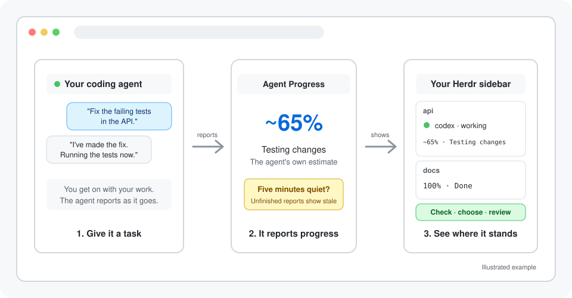

<h3 align="center">See how far your coding agents have got without opening every terminal</h3>

Agent Progress adds each agent's estimated completion and current activity to the <a href="https://herdr.dev">Herdr</a> sidebar. See who's reading code, who's testing changes, and whose task is ready for review.

MIT licensed &nbsp; · &nbsp; Local progress state &nbsp; · &nbsp; Claude Code and Codex on macOS

 

## Know where the work stands before you switch tabs

A busy agent might be starting its research or running its last check. Agent Progress shows the agent's estimate beside a short activity, so you can decide which terminal needs a closer look.

## Choose the detail you need at a glance

| | **Agent Progress** | Herdr's native agent state | Reading the conversation |
|---|:---:|:---:|:---:|
| **Visible in the sidebar** | Yes | Yes | No |
| **Shows working, blocked, or idle** | Alongside native state | Yes | In context |
| **Estimated task completion** | Yes | No | When the agent mentions it |
| **Short current activity** | Yes | No | In context |
| **Marks an old estimate as stale** | After five minutes | Not a task estimate | Check the last update |
| **Full reasoning and tool output** | No | No | Yes |

Keep native state for whether an agent is running or waiting. Use progress for how much of its task the agent thinks is finished. Open the conversation when you need the evidence.

## Follow the work from first look to final check

### See what each agent is doing

An expanded sidebar row reads `~65% · Testing changes`. Claude Code and Codex load the reporting instructions at session start and receive reminders while using tools. You don't need to invoke a skill for each task.

### Notice when an estimate needs another look

After five minutes without a report, the row includes `stale`. An agent can lower its estimate when it discovers more work, or report an activity without a percentage while it sizes up the task.

### Keep completion tied to the task

A reported 100% displays `Done`. A new task starts a new estimate, and a verified resume restores the matching session's task. Completion is the agent's judgment, not proof that a human has accepted the work.

## See your first progress update in three steps

<table>
<tr>
<td align="center" valign="top" width="33%"><h3>1</h3><b>Install the plugin</b> Run <code>herdr plugin install eliasstravik/herdr-agent-progress</code> inside Herdr. Herdr builds it with Cargo. Repository access is currently required.</td>
<td align="center" valign="top" width="33%"><h3>2</h3><b>Connect your clients</b> Install Herdr's Claude Code or Codex integration, then run <code>herdr plugin action invoke configure --plugin agent-progress</code>.</td>
<td align="center" valign="top" width="33%"><h3>3</h3><b>Give an agent a task</b> Restart or resume the client, review its normal trust prompts, and expand the agent sidebar. Estimates appear as the agent reports.</td>
</tr>
</table>

## Get everything included, free

<table align="center">
<tr>
<td align="center" valign="top">For developers running Claude Code or Codex in Herdr on macOS <h2>Free</h2>
&nbsp;&nbsp;✓&nbsp; Task estimates and activity in the native sidebar &nbsp;&nbsp;✓&nbsp; Stale indicators and explicit completion &nbsp;&nbsp;✓&nbsp; Session-start instructions and tool reminders &nbsp;&nbsp;✓&nbsp; Progress restored for verified native resumes &nbsp;&nbsp;✓&nbsp; Setup that preserves unrelated hooks and sidebar settings &nbsp;&nbsp;✓&nbsp; MIT-licensed source with no plugin subscription
</td>
</tr>
<tr>
<td align="center"></td>
</tr>
</table>

The repository is currently private. You need access to install it. Your coding clients' usual usage charges still apply, including their work to report progress.

## Get your questions answered

### What do I need installed?

macOS, Herdr 0.9.0 or newer, Rust/Cargo, a C compiler, Git, and a supported coding client. The tested client versions are Claude Code 2.1.272 and Codex 0.154.0. Follow the [getting-started guide](docs/getting-started.md) for native integrations and GitHub access.

### Is the percentage measured automatically?

No. The agent estimates progress across your whole task. It is not a timer, tool count, or time-to-finish prediction. Estimates can decrease, and an agent can report that it is still assessing the task.

### Why is the sidebar empty?

Configure the plugin, install the client's official Herdr integration, then restart or resume the client. The row appears after a verified session has reported progress. It is shown in the expanded agent sidebar. Run the [setup check](docs/getting-started.md#check-your-setup) if nothing appears.

### Does setup change my existing hooks?

It appends its own hooks and progress row, preserving unrelated configuration and comments. It refuses malformed files, symlink configuration paths, conflicting progress rows, and full sidebar layouts before editing live configuration. [Operations](docs/operations.md) explains configuration ownership and removal.

### Will I need to approve anything?

Review Herdr's install prompt and each client's normal hook trust prompts. A client sandbox may also ask for permission to access the local Herdr socket, process information, and plugin state. Setup does not change sandbox permissions. Denied reporting should not stop the agent's actual task.

### What happens when I resume an agent?

A verified resume restores that native session's task. An old process cannot update its replacement's task. A new request starts a new estimate, including after a previous task reached 100%.

### Which clients and platforms work?

Claude Code and Codex on macOS have live validation. Other clients and Linux are unverified; Windows reporting is unavailable. The [compatibility report](compatibility.md) lists the boundaries.

### Where is progress stored?

In a local SQLite database in the plugin state directory. A local publisher sends the display values to Herdr. The plugin has no hosted reporting service. Your coding client still uses its own service as usual.

### How do I update or remove it?

Use the [upgrade and removal steps](docs/getting-started.md#upgrade). Stop publishers before replacing the package, configure again after an upgrade, and unconfigure before uninstalling to remove owned hooks and rows.

### What does it cost?

Agent Progress is free and [MIT licensed](LICENSE). There is no plugin subscription or separate reporting API key. Your coding client's usage is billed as usual.

## See where your agents have got

Install, configure, and give an agent a task. Its next progress report puts the estimate and current activity beside the session you're already watching.

MIT licensed &nbsp; · &nbsp; Local progress state &nbsp; · &nbsp; Claude Code and Codex on macOS

